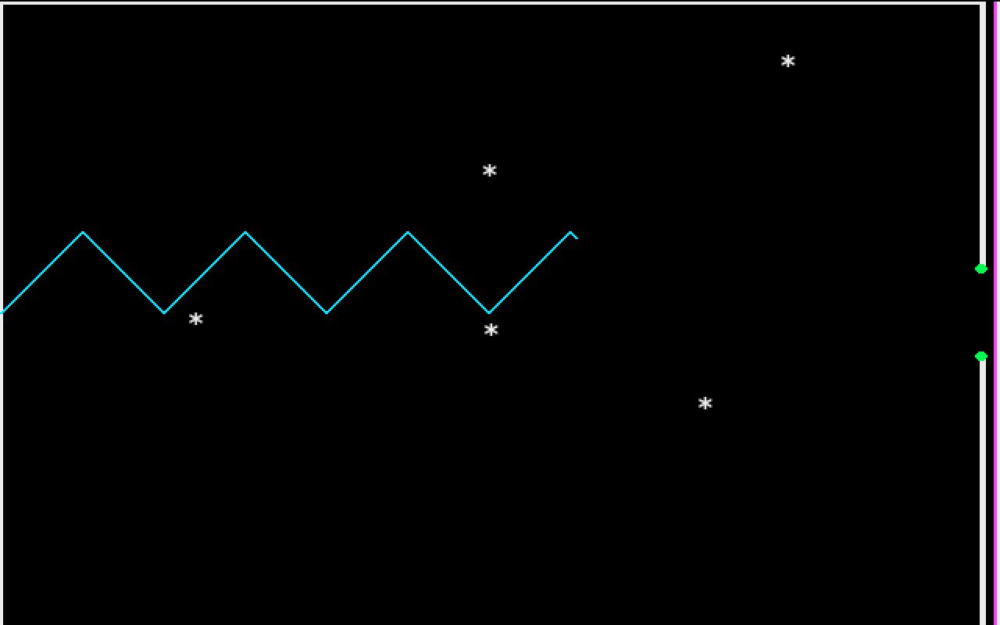
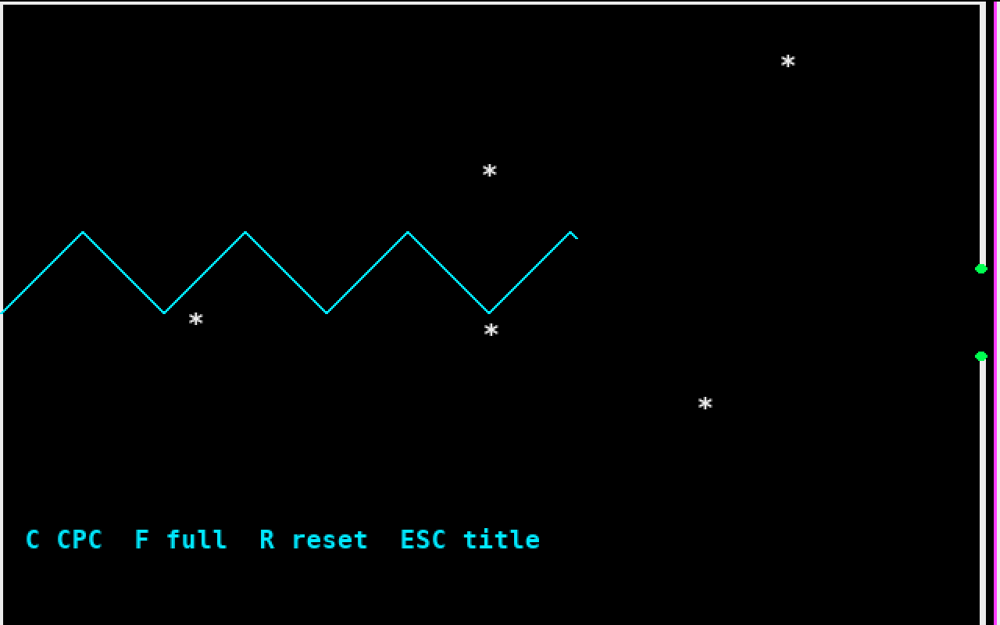
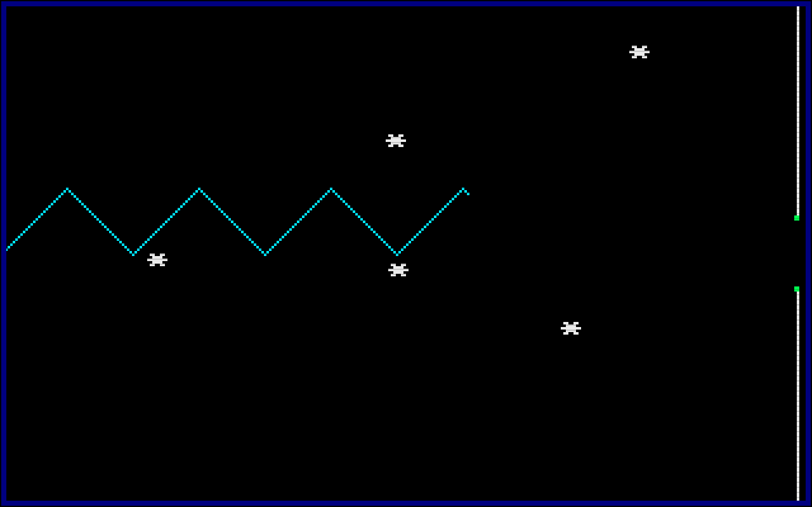

# Star Dodger

A Python/pygame remake of **STAR DODGER v2**, an Amstrad CPC BASIC type-in game by **G. French (14-2-92)**.

The original BASIC listing is preserved in [`original/star-dodger.bas`](original/star-dodger.bas). The Python and Go versions keep the original attribution and gameplay idea: hold `SPACE` to climb, release it to descend, dodge the killer asterisks, and reach the Nextscreen Gap.

## Screenshots

| Classic | Plus | Plus CPC Look |
| --- | --- | --- |
|  |  |  |

## Versions

- `python/stardodger/classic.py` - faithful pygame port of the BASIC version.
- `python/stardodger/plus.py` - same classic gameplay with practical modern conveniences:
  - resizable scaled window
  - fullscreen toggle
  - restart/title shortcuts
  - persistent top-six high scores
- `go/cmd/stardodgerplus` - Go/Ebiten version of Plus with the same classic gameplay.

## Requirements

- Python 3.11+
- [uv](https://docs.astral.sh/uv/)

`pygame` is declared in `pyproject.toml` and installed automatically by `uv`.

The Go version requires Go 1.24+ and downloads Ebiten through Go modules.

## Run

Faithful classic port:

```bash
uv run star-dodger
```

Classic gameplay plus scaling and persistent scores:

```bash
uv run star-dodger-plus
```

Useful Plus options:

```bash
uv run star-dodger-plus --fullscreen
uv run star-dodger-plus --scale 3
```

Go Plus version:

```bash
go run ./go/cmd/stardodgerplus
```

Or build a native binary:

```bash
go build ./go/cmd/stardodgerplus
./stardodgerplus
```

Tagged releases build Go binaries for Linux, macOS, and Windows:

```bash
git tag v0.1.0
git push origin v0.1.0
```

## Layout

```text
original/                  Original Amstrad CPC BASIC listing
python/stardodger/         Python package used by the uv entry points
python/tests/              Python regression tests
go/cmd/stardodgerplus/     Go/Ebiten executable
go/internal/nameentry/     Small Go helper package with unit tests
```

## Controls

- `SPACE` - climb
- release `SPACE` - descend
- `Q` - quit

Plus-only controls:

- `C` - toggle CPC look
- `F` - toggle fullscreen
- `R` - restart
- `ESC` - return to title

## Attribution

Original game: **STAR DODGER v2** by **G. French (14-2-92)**.

This repository is a Python remake/port and includes the original BASIC listing for reference and preservation.

The CPC-look text uses the public-domain [`Amstrad Character Set.png`](https://commons.wikimedia.org/wiki/File:Amstrad_Character_Set.png) sprite sheet by Mortenbscom from Wikimedia Commons, published under CC0 1.0.
